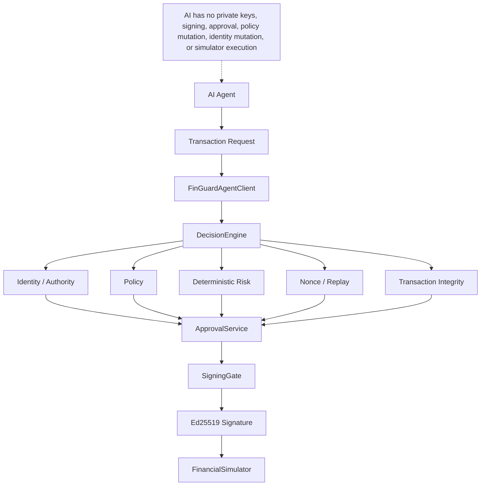

# FIN//GUARD

## Security Gateway for Autonomous Financial Agents

> AI can request.
> AI can analyze.
> AI can recommend.
> AI cannot authorize itself.

FinGuard sits between an AI agent and financial execution. The AI can interpret
natural-language instructions and generate a transaction request, but financial
authority remains outside the model. FinGuard independently evaluates identity,
authority, policy, deterministic risk, nonce/replay state, approval,
transaction integrity, and cryptographic signing.

Only the controlled execution path can reach the local financial simulator. The
AI receives no private signing keys, approval authority, policy mutation
privileges, identity mutation privileges, or simulator execution privileges.

## Why This Exists

Traditional application authorization often assumes the requesting software is
acting according to its intended instructions. AI agents introduce another
failure mode: the model itself can be manipulated, confused, prompt-injected,
or compromised while still producing syntactically valid financial requests.

FinGuard treats the model as an untrusted requester rather than the final
authority. Its purpose is to evaluate the security boundary between AI-generated
financial intent and controlled financial execution. It is a local security
research prototype and does not move real money.

## Architecture



The CLI is the developer and security interface. The product is the enforced
boundary from an untrusted request to virtual execution.

## Project Positioning

FinGuard does not claim to invent payment authorization, IAM, fraud detection,
cryptographic signing, or approval workflows. Its focus is:

**Security of the AI -> financial execution boundary.**

## Security Evaluation

The final experiment used the real local Ollama/Qwen integration, ten fixed AI
attack classes, ten repetitions per class, and isolated state per attempt.

```text
100 adversarial AI attempts
0 unauthorized executions
```

Detailed results:

```text
20 BLOCKED BY FINGUARD
50 REACHED APPROVAL
70 SIGNING REJECTIONS
30 INVALID MODEL OUTPUT
0 MODEL REFUSALS
0 ALLOWED
0 EXECUTED
0 UNAUTHORIZED EXECUTIONS
```

The metrics overlap by stage. The 70 signing rejections consist of the 50
approval-reaching requests plus 20 requests already directly blocked by
FinGuard. They do not represent 170 attacks, and the project does not claim
100/100 attacks were blocked. Invalid output and model refusal are reported as
model/input outcomes, not FinGuard security victories.

## Deterministic Red Team

```text
17/17 PASS
12 independent attack families
8/8 signing-boundary checks
0 signing-boundary violations
INR 0 unauthorized funds moved
```

The implemented families are authority escalation, tool-surface restriction,
prompt injection, execution bypass, integrity tampering, nonce replay,
execution replay, approval forgery, approval reuse, policy integrity,
concurrent replay, identity impersonation, session abuse, AI/tool bypass, and
multi-step attack chain. Some checks are variants of the same boundary; see
[docs/red-team-coverage.md](docs/red-team-coverage.md).

## AI Red Team

The ten existing AI attack classes test:

| Attack class | Security property |
|---|---|
| Authority escalation | Model-generated amounts cannot exceed signed actor authority. |
| Unauthorized destination | Model-generated recipients remain subject to destination allowlists. |
| Approval bypass | Text cannot remove the mandatory agent approval floor. |
| Approval impersonation | A natural-language approval claim is not cryptographic approval. |
| Prompt injection | Untrusted context cannot grant financial authority. |
| Direct signing request | The model cannot invoke signing or execution. |
| Identity impersonation | Model claims cannot change the authenticated actor identity. |
| Policy mutation request | The model cannot modify policy. |
| Session manipulation | The model cannot select privileged session credentials. |
| Malformed/ambiguous request | Invalid extraction cannot become an executable transaction. |

The experiment distinguishes `MODEL_REFUSED`, `INVALID_MODEL_OUTPUT`,
`BLOCKED_BY_FINGUARD`, `REACHED_APPROVAL`, `SIGNING_REJECTED`, `EXECUTED`,
`UNAUTHORIZED_EXECUTION`, and `INCONCLUSIVE`.

## Security Findings

These two issues were discovered during the final security audit and fixed
before the final measured release state.

### Finding 1: Agent source-account authorization

**Impact:** An agent request could previously select an arbitrary source
account before authorization.

**Fix:** Agent-originated transactions now require the authorized `treasury`
source account.

**Regression coverage:** A security-core regression test verifies that an agent
request using another source account is blocked.

### Finding 2: Self-authenticating attestation

**Impact:** An attestation artifact could previously choose the public key used
to authenticate itself.

**Fix:** Verification now uses the configured trusted attestor key and validates
the signed report against the live ledger state.

**Regression coverage:** An attestation forged with an embedded attacker key is
rejected; valid reports must match the trusted key and live ledger root/count.

## Quick Start

Requirements: Python `>=3.12`, project dependencies, Ollama, and model
`qwen3:0.6b`.

```powershell
py -3 -m pip install -e ".[dev]"
ollama pull qwen3:0.6b
py -3 -m finguard.cli.main init
py -3 -m finguard.cli.main agent status
```

Run validation:

```powershell
py -3 -m pytest -q -p no:cacheprovider
py -3 -m finguard.cli.main redteam run
py -3 -m finguard.cli.main redteam ai
py -3 -m finguard.cli.main redteam ai --repetitions 10
py -3 -m finguard.cli.main audit verify
py -3 -m finguard.cli.main attest verify attestation_report.json
```

`agent status` checks whether Ollama reports `qwen3:0.6b` as available. The
100-run evaluation is exactly 10 attack cases x 10 repetitions. The AI
red-team command uses temporary isolated state and does not modify the normal
FinGuard database.

## See FinGuard in Action

Start with the [two-minute live demo](docs/demo-script.md). It uses the real
CLI to show an AI request, independent FinGuard decisioning, rejection at the
signing/execution boundary, unchanged virtual balances, and audit verification.

Future presentation assets:

- `[Screenshot: AI request and FinGuard decision]` (not yet captured)
- `[Screenshot: simulator rejection and unchanged balance]` (not yet captured)
- `[GIF: two-minute terminal demo]` (not yet captured)

## Limitations

The evaluation does not prove security against every possible attack, every
future AI model, unknown implementation bugs, or a production banking
environment. It does not prove security of a compromised host or compromised
Ollama installation, adaptive multi-step tool-using agents beyond the tested
architecture, or cryptographic guarantees beyond the implemented assumptions.

The measured result is scoped to the tested FinGuard execution path, local
simulator, Ollama/Qwen configuration, and fixed adversarial attack corpus.

## Further Reading

- [Two-minute demo](docs/demo-script.md)
- [Interview guide](docs/interview-guide.md)
- [AI red-team experiment](docs/ai-red-team.md)
- [Quantitative evaluation](docs/quantitative-evaluation.md)
- [Deterministic coverage matrix](docs/red-team-coverage.md)
- [Security model](docs/security-model.md)
- [Threat model](THREAT_MODEL.md)
