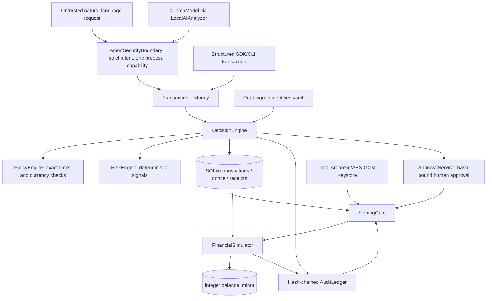
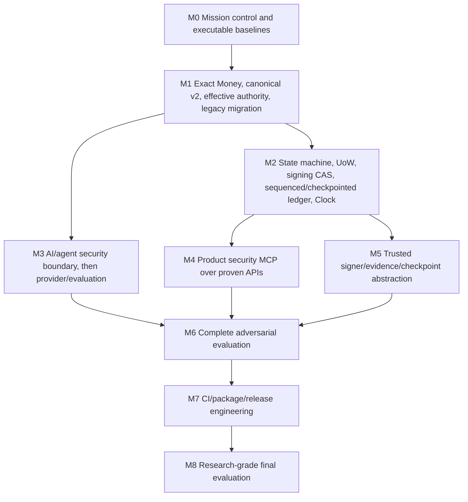

# FIN//GUARD Master Architecture and Roadmap

**State snapshot:** 2026-10-03, branch `m1-money`, starting from pushed M2.3
commit `24c8732`; M3 AI/agent boundary changes are in progress and uncommitted.
This describes observed code and tests, not intended architecture. No release
approval is implied.

## Repository Baseline

- Package: `finguard`, Python >=3.12; current configured interpreter Python
  3.13.7. Runtime stack: Typer/Rich, Pydantic 2, SQLAlchemy 2/SQLite,
  cryptography/PyNaCl, argon2-cffi, networkx, PyYAML. Test tooling: pytest,
  pytest-cov/Hypothesis in dev extras, Ruff in dev extras.
- Git checkpoint: M3 started from `m1-money` at `24c8732`, same as
  `origin/m1-money`; M3 work is currently uncommitted.
- M2.3 full-suite baseline before M3: **239 passed, 0 failed**. After M3,
  **274 passed, 0 failed**; the boundary-only suite had **35 passed**, and the
  combined boundary/AI integration/red-team slice had **46 passed**.
  SQLAlchemy `datetime.utcnow()` deprecation warnings remain.
- Focused authority-chain, simulator, signing, approval, attack and migration
  slices passed. Threaded and spawned-process signing races prove one stored
  signature; threaded/process execution races prove one financial effect.
- Final isolated benchmark: decision N=1000 p50 7.117 ms, p95 9.711 ms,
  p99 12.857 ms, 133.57 ops/s; Money parse/format p95 0.0021 ms; canonical hash
  p95 0.0165 ms; Ed25519 sign p95 0.0377 ms; ledger 200-entry verify 11.678 ms.
  Hardware/OS metadata was not captured, so these are diagnostic measurements,
  not a reproducible committed baseline.
- Ruff passes on the changed M3 Python files. The Windows shell has no `make`;
  test and attack equivalents ran directly. Migration delegates to a real
  script; docs and attack-loop Make targets remain incomplete.

## Architecture As Implemented

High-level decision, approval, signing, and simulator execution writes use
explicit SQLite transactions with their required database evidence. Decision
records, nonce, approval request when needed, lifecycle CAS, receipt, and DECISION
audit append share one session. Approval state and audit evidence share a
transaction; signing CAS/signature and signing evidence share a transaction.
Simulator debit/credit, unique execution record, lifecycle CAS, and execution
audit evidence also commit together. Execution alone acquires SQLite's writer
reservation with `BEGIN IMMEDIATE` before its read/validate/write sequence, with
an explicit 5000 ms `busy_timeout`; this is limited to the simulator boundary.
Deterministic test checkpoints prove rollback/retry, and thread plus spawned
process tests use independent sessions/processes. Forced process death during
commit remains untested. The audit ledger has monotonically sequenced,
identity-key-bound signed checkpoints; checkpoint creation is explicit and
on-demand, and no external anchor protects against truncation to an earlier
valid checkpoint. The local `AgentSecurityBoundary` allows one proposal call
and delegates to the existing core; there is no product `finguard.mcp` server.
`tools/devtools_mcp.py` is an engineering helper, not the financial-action
boundary.

| Component | Current inputs/outputs and authority | State mutation / signing / execution | Evidence and gap |
| --- | --- | --- | --- |
| AI/agent (`finguard/ai`, `agent/boundary.py`, `agent/treasury.py`) | Strict extraction schema; host binds identity/source/time; one proposal-only capability; core applies policy/authority | No signing, approval, key, policy-mutation, or execution operation exposed to agent | 34 boundary tests plus existing AI integration/red-team slices; no provider protocol, model digest/run manifest, product MCP server, or external evaluation |
| SDK / CLI | SDK and agent CLI submit to `DecisionEngine`; operator CLI exposes admin, approve and sign commands | SDK cannot sign/approve/execute; local operator CLI has privileged commands | SDK capability test and CLI help; no server-bound MCP identity |
| Money / transaction | `Money` is positive integer minor units plus INR/USD/EUR/JPY/KWD; `Transaction` defaults/fixes new transactions to canonical v2 | In-memory domain state only | Unit/property/regression tests; exact legacy database migration only partly verified |
| Identity / authority | Root-signed YAML registry with per-actor source/destination allowlists, authority limit and authority currency | Root key can mutate registry; decision path consumes actor configuration | Tests prove source lists load, empty grants deny, agent/literal wildcard denies, trusted operator wildcard use is recorded; AccountRegistry/alias resolution absent |
| Decision / policy / risk | `DecisionEngine` combines actor authority, policy, risk, nonce claim and receipt | Transaction, nonce, optional approval request, lifecycle CAS, receipt, and DECISION audit append share one SQLite transaction | Full suite and injected receipt/pre-commit rollback tests; process-level decision contention remains untested |
| Approval | Approval binds hash, policy request, expiry, prospective approved version, and approver key from the root-signed identity registry | Approval row, request count/state, optional APPROVED CAS, and approval audit share one transaction | Stale-version, key-substitution, forged-state, duplicate-approval, and evidence-failure rollback tests |
| Signing | Revalidates receipt, policy, authority, approval, signer identity key and authorized row version; signature remains over canonical v2 transaction bytes | Signature/key/signed version and SIGNED transition use row-level CAS with signing audit in the same transaction | Threaded and spawned-process exactly-one-signature tests plus evidence-failure rollback/retry; lifecycle counter is cross-checked in stored evidence but not directly signed, and full-database rewrite resistance is out of scope |
| Simulator | Revalidates decision/audit, policy, authority, approval, signer evidence, canonical hash and Ed25519 signature | `BEGIN IMMEDIATE` serializes the settlement read/validate/write boundary before transaction/evidence reads; balance debit/credit, unique execution row, EXECUTED CAS, and execution audit evidence share that transaction | Immediate-lock SQL trace, six deterministic rollback/reload/retry checkpoints, evidence consistency, idempotent replay, separate-session thread race, and spawned-process single-effect test; forced process death and signed checkpoints absent |
| Audit / attestation | Sequenced SQLite hash chain; deterministic Ed25519 checkpoints bound to identity-registry keys; existing attestation artifact | Audit appends and explicit checkpoint creation | Checkpoint signature/linkage/tamper tests; co-located database can be truncated to an earlier valid checkpoint without external anchoring |
| Engineering MCP | `tools/devtools_mcp.py` tools run tests/attacks/bench and read task/invariant docs | Can launch repository commands; no transaction authority | Path jail is used for documentation reads; not a security MCP implementation |

## Trust Boundaries

- **Untrusted:** request text, model JSON, SDK/CLI values, metadata, engineering
  MCP caller parameters.
- **Controlled sources:** root-signed actor registry, policy configuration,
  approval identities, trusted local signing/attestor public keys.
- **Sensitive authority:** root key, signing keys, approval authority, policy
  and identity mutation, transaction-signing gate, simulator execution.
- **Database boundary:** transaction rows are rehashed against decision and
  receipt evidence; ledger prefixes can be checked against signed checkpoints.
  Checkpoints and ledger remain in the same SQLite file. A privileged writer
  cannot forge a checkpoint without its identity-bound key, but can remove a
  latest checkpoint and truncate to an earlier valid one unless a checkpoint
  head is externally anchored. Entries after the latest checkpoint are not
  covered by that checkpoint.
- **MCP boundary:** product MCP does not exist; security properties for it are
  unproven. Devtools MCP is not evidence for transaction MCP isolation.

## Dependency Graph

The M3 local agent boundary reuses the frozen Money and M2 interfaces. Provider
and evaluation work remains open and requires stable decision outcomes. M4 must
wait until M2 establishes atomic state semantics; otherwise it creates a second
interface over unsafe write paths. M5 signer work owns signing/ledger code and
must be serialized with M2. M6 consumes the stable M3/M4/M5 interfaces; M7
follows reproducible results, not before.

## Requirement Traceability

### M2.2 Completed Guarantees

- Decision, approval, signing, and local execution state plus required SQLite evidence commit atomically.
- Execution uses targeted `BEGIN IMMEDIATE` with a 5000 ms busy timeout; two spawned processes executing the same transaction observe one deterministic result and one financial effect.
- Test-injected failures rollback database writes; a fresh session reload verifies persistent state and retry completes exactly once.
- Lifecycle revision is enforced through SigningGate CAS, recorded `signed_version` evidence, and execution-time equality checks. It is intentionally not included in canonical transaction bytes because it is a storage concurrency token rather than caller-controlled authority data. Full SQLite-file rewrite remains able to rewrite the unkeyed ledger; signature-envelope binding remains open for a separate security review.

### M2.3 Status and Remaining Limitations

- Monotonic ledger sequencing and deterministic, identity-key-bound Ed25519
  checkpoints are implemented. Checkpoint creation is atomic with the ledger
  prefix it covers and verification checks sequence, signature, linkage, and
  the actual ledger head at that sequence.
- Checkpoints are explicit/on-demand, not automatically created for each
  ledger append. Entries newer than the latest checkpoint remain unsigned.
- Checkpoints are stored in the same SQLite database. Without external
  anchoring, a privileged database writer can truncate to an earlier valid
  checkpoint. External anchoring remains future work and is not claimed.

| Requirement | Implementation | Test/attack proof | Status |
| --- | --- | --- | --- |
| Mission control | AGENTS, tasks, Makefile, devtools MCP | Tier scripts exist; some targets are placeholders | PARTIAL |
| Exact Money | `finguard/money.py`, `Currency` exponents | Unit, Hypothesis, hostile parser, AST guard | PASS in local focused tests |
| Canonical v2 and v1 compatibility | Domain prefix, integer amount, metadata digest, separate v1 encoder/vector | Canonical, metadata, offset timestamp tests | PARTIAL: G6 human/verifier approval pending; real v1 DB artifact untested |
| Effective allowlist authority | Signed source/destination actor lists, explicit actor authority currency, empty-list deny, agent wildcard deny | Registry, helper, decision, cross-currency and wildcard tests | PARTIAL: account aliases/registry and legacy actor review migration absent |
| Legacy data conversion | Dry-run/apply exactness migration, quarantine table, backup required, unsigned request fail-closed | Populated SQLite exact/inexact/non-finite fixture, dry-run immutability, idempotence | PARTIAL: not applied to user DB; restore drill and real pre-v2 artifact verification pending |
| Simulator integer money | `balance_minor` and conditional arithmetic | Representative conservation, rejected no-mutation, replay/signature tests | PARTIAL: generated multi-transfer property/stateful suite absent |
| M2.1 authority chain | Decision receipt/hash/version, registry-bound approver/signer keys, approval version, signing CAS, execution verification/CAS | Authority-chain integration and attacker regressions; M2.3 baseline full suite 239 passed | PARTIAL: lifecycle version is not signed as bytes; privileged full-database rewrite remains out of scope |
| M2.2 state and atomicity | Shared-session DB transactions for decision, approval, signing, and local simulator execution; targeted immediate write lock for execution | Evidence-failure rollback tests, six execution fault points, reload/retry, idempotent replay, threaded races, spawned-process signing/execution races | PASS for tested DB-local guarantees; abrupt process death and process-level decision contention remain open |
| Ledger/checkpoints | Sequenced hash chain, canonical Ed25519 checkpoints, identity-registry key binding | Signed checkpoint tests for normal verification, tampering, linkage, and replay | PASS for local on-demand checkpoints; no external anchor, so rollback/truncation to a prior valid checkpoint is not detectable |
| AI/agent boundary | Strict extraction, server-bound identity/source/time, one allowlisted proposal capability, bounded state machine, core evidence verification | `tests/security/test_agent_security_boundary.py` and existing AI integration/red-team slices; M3 focused validation 46 passed | PASS for local proposal boundary; no remote MCP adapter, product MCP server, provider protocol, or model evaluation |
| AI provider/evaluation | Ollama client and extraction schema | Local AI tests and red-team tests | PARTIAL; no provider protocol/CIs/reproducible multi-model harness |
| Product MCP | No package or tool surface | No MCP-specific security tests | NOT STARTED |
| Release/CI | Packaging and documentation exist | Full local suite passes; changed-file Ruff passes; Python-matrix CI not run | NOT STARTED |

## Highest-Priority Work

1. Independent verifier sign-off and human approval for authenticated canonical
   byte changes; keep branch unpublished until G6 approval is recorded.
2. Run migration only against a disposable copy of a complete pre-v2 database;
   verify the generated backup restore, quarantine report, exact rows, and
   historical v1 signature verification. Do not apply to the operator database
   before explicit authorization.
3. Add AccountRegistry and alias/currency model, migrate legacy actor allowlists
   to explicit reviewed grants, and remove remaining hardcoded account literals.
4. M2.3 local signed checkpoints are implemented; external anchoring remains
   open. Do not treat checkpoints as protection against truncation to an
   earlier valid checkpoint while evidence remains only in the same database.
5. Run Python-matrix CI on 3.12/3.13, then repeat benchmarks with OS/hardware
   metadata; local full pytest and changed-file Ruff have passed.
6. Only after M2, build product MCP, provider/evaluation integration, and release
   packaging in dependency order.

## Publication Status

The M3 work started from pushed `m1-money` commit `24c8732`. The M3 focused
boundary/integration/red-team slice passes 46 tests (35 in the new boundary
file); the full suite passes 274 tests. Changed-file Ruff checks pass and
`git diff --check` is clean. Final diff review passed; commit/push are pending.
No transaction canonical bytes, approval/signature formats, simulator
semantics, or M2 checkpoint code were changed. M3 changes are uncommitted;
there is no M3 commit or push yet. Product MCP, multi-model evaluation,
external anchoring, and abrupt process-death testing remain unimplemented.
