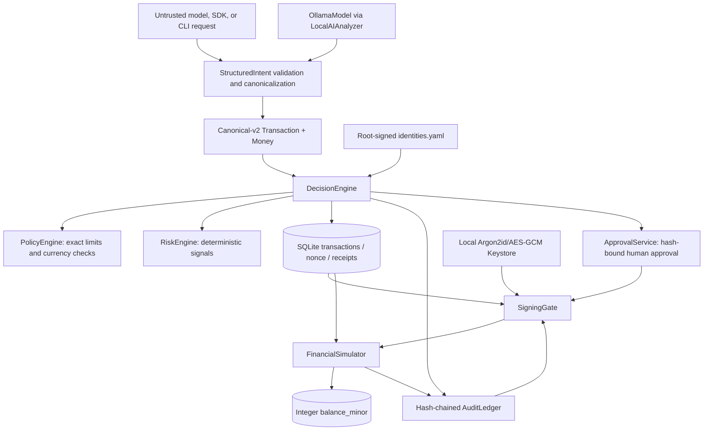
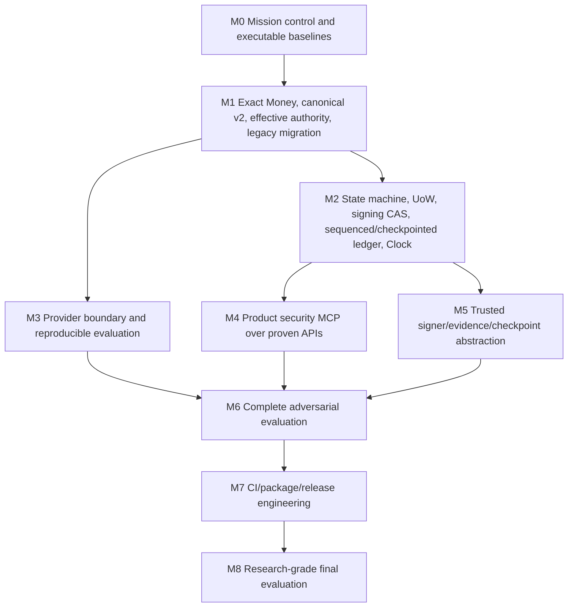

# FIN//GUARD Master Architecture and Roadmap

## Current Implementation Status (M4)

The active milestone is `m4-bounded-orchestration`. It adds a bounded orchestration
layer around the existing deterministic authority path; it does not replace the
core financial approval/signing/execution pipeline.

The implemented architecture is:

```text
Agent / StructuredIntent -> M3.2 Guardrails -> DecisionEngine -> Approval -> Signing -> Simulator
                               ^
                               |
                       bounded M4 orchestrator
```

The orchestrator tracks state, step/tool budgets, deadlines, and guardrail
checks, but it never becomes authority. It cannot approve, sign, execute, or
mutate policy or financial state directly. The actual financial path remains the
existing FinGuard decision and execution chain.

M3.1 remains the structured intent boundary and M3.2 remains the guardrail
filter; M4 adds deterministic orchestration around them. The roadmap sequence is:

- M3.1 — Structured Intent
- M3.2 — Deterministic Guardrails
- M3.3 — Adversarial Agent Harness
- M4 — Bounded Agent Orchestration
- M5 — MCP Security Boundary
- M6 — Agentic Security Evaluation / Red Team
- M7 — Research / Distribution

M3.1 adds `finguard/agent/intent.py` as a deterministic input boundary above
the existing core. The SDK proposal path now parses strict `StructuredIntent`,
checks exact money and the configured active AGENT registry identity, then binds
the normalized intent digest into metadata covered by the existing canonical
v2 transaction hash. The unchanged `DecisionEngine`, approval, signing, and
simulator services remain authoritative. This milestone adds no MCP, planner,
autonomous loop, or external model API. See
[`M3.1-STRUCTURED-INTENT.md`](./M3.1-STRUCTURED-INTENT.md) for the complete
boundary and limitations. Validation on Python 3.13.7: 43 intent-boundary
tests passed, 82 focused boundary/regression tests passed, and the full suite
passed (282 tests). Selected Ruff checks and `git diff --check` passed. Existing
SQLAlchemy `datetime.utcnow()` deprecation warnings remain.
The next planned milestone is M3.2 deterministic agent guardrails; it is not
implemented by this change.

**State snapshot:** 2026-10-02, branch `m1-money`, baseline commit `4a8461f`
with uncommitted M2.2 changes. This describes observed code and tests, not
historical reports or intended architecture. No release approval is implied.

## Repository Baseline

- Package: `finguard`, Python >=3.12; current configured interpreter Python
  3.13.7. Runtime stack: Typer/Rich, Pydantic 2, SQLAlchemy 2/SQLite,
  cryptography/PyNaCl, argon2-cffi, networkx, PyYAML. Test tooling: pytest,
  pytest-cov/Hypothesis in dev extras, Ruff in dev extras.
- Git checkpoint: `m1-money` at `4a8461f`, same as `origin/m1-money`; M2.2
  atomicity changes are currently uncommitted.
- Pre-M2.1 baseline with preserved idempotency changes: **196 passed, 0 failed**.
  Final full-suite run after M2.2 changes: **221 passed, 0 failed** in 51.37s.
  SQLAlchemy `datetime.utcnow()` deprecation warnings remain.
- Focused authority-chain, simulator, signing, approval, attack and migration
  slices passed. Threaded and spawned-process signing races prove one stored
  signature; threaded/process execution races prove one financial effect.
- Final isolated benchmark: decision N=1000 p50 7.117 ms, p95 9.711 ms,
  p99 12.857 ms, 133.57 ops/s; Money parse/format p95 0.0021 ms; canonical hash
  p95 0.0165 ms; Ed25519 sign p95 0.0377 ms; ledger 200-entry verify 11.678 ms.
  Hardware/OS metadata was not captured, so these are diagnostic measurements,
  not a reproducible committed baseline.
- Ruff still reports repository style/import findings. The Windows shell has
  no `make`; test and attack equivalents ran directly. Migration delegates to a
  real script; docs and attack-loop Make targets remain incomplete.

## Architecture As Implemented



High-level decision, approval, signing, and simulator execution writes use
explicit SQLite transactions with their required database evidence. Decision
records, nonce, approval request when needed, lifecycle CAS, receipt, and DECISION
audit append share one session. Approval state and audit evidence share a
transaction; signing CAS/signature and signing evidence share a transaction.
Simulator debit/credit, unique execution record, lifecycle CAS, and execution
audit evidence also commit together. Execution alone acquires SQLite's writer
reservation with `BEGIN IMMEDIATE` before its read/validate/write sequence, with
an explicit 5000 ms `busy_timeout`; this is limited to the simulator boundary.
Deterministic test checkpoints prove rollback/retry, and thread plus spawned
process tests use independent sessions/processes. Forced process death during
commit remains untested. There is no product `finguard.mcp` server;
`tools/devtools_mcp.py` is an engineering helper, not the financial-action
boundary.

| Component | Current inputs/outputs and authority | State mutation / signing / execution | Evidence and gap |
| --- | --- | --- | --- |
| AI (`finguard/ai`, `agent/treasury.py`) | Local Ollama JSON is untrusted; schema yields amount/currency/destination/purpose and advisory analysis | No signing or execution capability | Local AI and AI attack tests; no provider protocol, model digest/run manifest, or CI-stable external evaluation |
| SDK / CLI | SDK and agent CLI submit proposals through `StructuredIntentBoundary` to `DecisionEngine`; operator CLI exposes admin, approve and sign commands | SDK cannot sign/approve/execute; local operator CLI has privileged commands | Structured-intent security tests and CLI help; no server-bound MCP identity |
| Money / transaction | `Money` is positive integer minor units plus INR/USD/EUR/JPY/KWD; `Transaction` defaults/fixes new transactions to canonical v2 | In-memory domain state only | Unit/property/regression tests; exact legacy database migration only partly verified |
| Identity / authority | Root-signed YAML registry with per-actor source/destination allowlists, authority limit and authority currency | Root key can mutate registry; decision path consumes actor configuration | Tests prove source lists load, empty grants deny, agent/literal wildcard denies, trusted operator wildcard use is recorded; AccountRegistry/alias resolution absent |
| Decision / policy / risk | `DecisionEngine` combines actor authority, policy, risk, nonce claim and receipt | Transaction, nonce, optional approval request, lifecycle CAS, receipt, and DECISION audit append share one SQLite transaction | Full suite and injected receipt/pre-commit rollback tests; process-level decision contention remains untested |
| Approval | Approval binds hash, policy request, expiry, prospective approved version, and approver key from the root-signed identity registry | Approval row, request count/state, optional APPROVED CAS, and approval audit share one transaction | Stale-version, key-substitution, forged-state, duplicate-approval, and evidence-failure rollback tests |
| Signing | Revalidates receipt, policy, authority, approval, signer identity key and authorized row version; signature remains over canonical v2 transaction bytes | Signature/key/signed version and SIGNED transition use row-level CAS with signing audit in the same transaction | Threaded and spawned-process exactly-one-signature tests plus evidence-failure rollback/retry; lifecycle counter is cross-checked in stored evidence but not directly signed, and full-database rewrite resistance is out of scope |
| Simulator | Revalidates decision/audit, policy, authority, approval, signer evidence, canonical hash and Ed25519 signature | `BEGIN IMMEDIATE` serializes the settlement read/validate/write boundary before transaction/evidence reads; balance debit/credit, unique execution row, EXECUTED CAS, and execution audit evidence share that transaction | Immediate-lock SQL trace, injected rollback/reload/retry, idempotent replay, separate-session thread race, and spawned-process single-effect test; forced process death remains untested |
| Audit / attestation | Sequenced SQLite hash chain; identity-key-bound Ed25519 checkpoints and attestation | Appends sequence-linked audit events; checkpoint creation binds sequence, head, prior checkpoint hash, signer identity and key | Checkpoint canonicalization, identity binding, atomic creation, offline verification, tampering and process-append tests; external anchoring is absent |
| Structured intent (M3.1) | Untrusted SDK/agent proposal is strict-schema validated, identity-bound and converted to an existing canonical-v2 transaction | No direct state mutation, approval, signing, or execution; dispatches only to `DecisionEngine` | 43 focused boundary tests and full suite (282 tests) passed |
| Engineering MCP | `tools/devtools_mcp.py` tools run tests/attacks/bench and read task/invariant docs | Can launch repository commands; no transaction authority | Path jail is used for documentation reads; not a security MCP implementation |

## Trust Boundaries

- **Untrusted:** request text, model JSON, SDK/CLI values, metadata, engineering
  MCP caller parameters.
- **Controlled sources:** root-signed actor registry, policy configuration,
  approval identities, trusted local signing/attestor public keys.
- **Sensitive authority:** root key, signing keys, approval authority, policy
  and identity mutation, transaction-signing gate, simulator execution.
- **Database boundary:** transaction/receipt edits are checked against decision,
  approval, signing, execution, and checkpoint evidence. Locally signed
  checkpoints protect the ledger prefix they cover against rewriting without
  the registry-bound signing key. No external anchor prevents deletion or
  replacement of the entire database together with its latest unanchored
  checkpoint.
- **Agent boundary:** intent text and context are hostile data. The boundary
  admits only one fixed proposal action/capability and has no general tool
  execution path. It rejects authority-shaped schema fields, but does not
  attempt to semantically classify every prompt-injection string.
- **MCP boundary:** product MCP does not exist; security properties for it are
  unproven. Devtools MCP is not evidence for transaction MCP isolation.

## Dependency Graph



M3 provider work may begin after the Money wire contract is frozen, but its
measurements require stable decision outcomes. M4 must wait until M2 establishes
atomic state semantics; otherwise it creates a second interface over unsafe
write paths. M5 checkpoint work owns signing/ledger code and must be serialized
with M2. M6 consumes the stable M3/M4/M5 interfaces; M7 follows reproducible
results, not before.

## Historical M2.2 Snapshot (Not Current Status)

The remaining requirement-traceability notes and publication report below were
written against the pre-M2.3 `4a8461f` snapshot. They are retained as a
historical record only and are superseded by the current implementation status
at the top of this document and by M3.1-specific details in
[`M3.1-STRUCTURED-INTENT.md`](./M3.1-STRUCTURED-INTENT.md). In particular,
their statements that M2.3 checkpoints do not exist are obsolete.

### M2.2 Completed Guarantees

- Decision, approval, signing, and local execution state plus required SQLite evidence commit atomically.
- Execution uses targeted `BEGIN IMMEDIATE` with a 5000 ms busy timeout; two spawned processes executing the same transaction observe one deterministic result and one financial effect.
- Test-injected failures rollback database writes; a fresh session reload verifies persistent state and retry completes exactly once.
- Lifecycle revision is enforced through SigningGate CAS, recorded `signed_version` evidence, and execution-time equality checks. It is intentionally not included in canonical transaction bytes because it is a storage concurrency token rather than caller-controlled authority data. Full SQLite-file rewrite remains able to rewrite the unkeyed ledger; signature-envelope binding remains open for a separate security review.

### Remaining M2.3 Work

- Forced process termination at commit boundaries, process-level signing/decision races, lifecycle-version signature-envelope review, sequenced ledger/checkpoints, and external anchoring remain open. No M2.3 checkpoint or anchoring functionality is implemented here.

| Requirement | Implementation | Test/attack proof | Status |
| --- | --- | --- | --- |
| Mission control | AGENTS, tasks, Makefile, devtools MCP | Tier scripts exist; some targets are placeholders | PARTIAL |
| Exact Money | `finguard/money.py`, `Currency` exponents | Unit, Hypothesis, hostile parser, AST guard | PASS in local focused tests |
| Canonical v2 and v1 compatibility | Domain prefix, integer amount, metadata digest, separate v1 encoder/vector | Canonical, metadata, offset timestamp tests | PARTIAL: G6 human/verifier approval pending; real v1 DB artifact untested |
| Effective allowlist authority | Signed source/destination actor lists, explicit actor authority currency, empty-list deny, agent wildcard deny | Registry, helper, decision, cross-currency and wildcard tests | PARTIAL: account aliases/registry and legacy actor review migration absent |
| Legacy data conversion | Dry-run/apply exactness migration, quarantine table, backup required, unsigned request fail-closed | Populated SQLite exact/inexact/non-finite fixture, dry-run immutability, idempotence | PARTIAL: not applied to user DB; restore drill and real pre-v2 artifact verification pending |
| Simulator integer money | `balance_minor` and conditional arithmetic | Representative conservation, rejected no-mutation, replay/signature tests | PARTIAL: generated multi-transfer property/stateful suite absent |
| M2.1 authority chain | Decision receipt/hash/version, registry-bound approver/signer keys, approval version, signing CAS, execution verification/CAS | Authority-chain integration and attacker regressions; 219-test full suite | PARTIAL: lifecycle version is not signed as bytes; ledger has no signed checkpoint |
| M2.2 state and atomicity | Shared-session DB transactions for decision, approval, signing, and local simulator execution; targeted immediate write lock for execution | Evidence-failure rollback tests, six execution fault points, reload/retry, idempotent replay, threaded races, spawned-process execution race | PASS for requested DB-local M2.2 behavior; forced process-death recovery and process-level decision/signing races remain open |
| Ledger/checkpoints/anchoring | Existing unsequenced hash chain and local attestation | Ordinary tamper detection only | OPEN for signed checkpoints and external anchoring; not part of M2.2 |
| Ledger integrity | Unsequenced hash chain and local attestation | Ordinary tamper detection only | PARTIAL; no signed checkpoint or full-chain rewrite protection |
| AI provider/evaluation | Ollama client, extraction schema, fixed 10-case AI corpus | Local AI tests and red-team tests | PARTIAL; no provider protocol/CIs/reproducible multi-model harness |
| Product MCP | No package or tool surface | No MCP-specific security tests | NOT STARTED |
| Release/CI | Packaging and documentation exist | Ruff non-green; 3 known full-suite failures; CI not run | NOT STARTED |

## Highest-Priority Work

1. Independent verifier sign-off and human approval for authenticated canonical
   byte changes; keep branch unpublished until G6 approval is recorded.
2. Run migration only against a disposable copy of a complete pre-v2 database;
   verify the generated backup restore, quarantine report, exact rows, and
   historical v1 signature verification. Do not apply to the operator database
   before explicit authorization.
3. Add AccountRegistry and alias/currency model, migrate legacy actor allowlists
   to explicit reviewed grants, and remove remaining hardcoded account literals.
4. Remaining M2.3 work: monotonic ledger sequence, signed checkpoints, and
  external anchoring. Forced process-death recovery, process-level decision/
  signing contention, and lifecycle-version signature-envelope review also
  remain open. Do not treat the uncheckpointed ledger as externally anchored.
5. Run T1/T2 and CI on Python 3.12/3.13, then repeat benchmarks with OS/hardware
  metadata; only the focused Ruff check was run for M2.1.
6. Only after M2, build product MCP, provider/evaluation integration, and release
   packaging in dependency order.

## Publication Status

The M2.2 work started from `m1-money` at `4a8461f`. No canonical transaction
bytes, vectors, or signed transaction field set changed. Final local full suite:
221 passed, 0 failed. The spawned-process execution race passed three
consecutive additional runs; the focused process/recovery slice passed 39 tests
before the final lifecycle-version case was added. Focused Ruff remains
non-green due to baseline findings; the requested-file comparison matches
committed HEAD. Forced process-death recovery, process-level signing/decision
contention, the unsigned same-database audit limitation, missing signed
checkpoints, and absent external anchoring remain.
