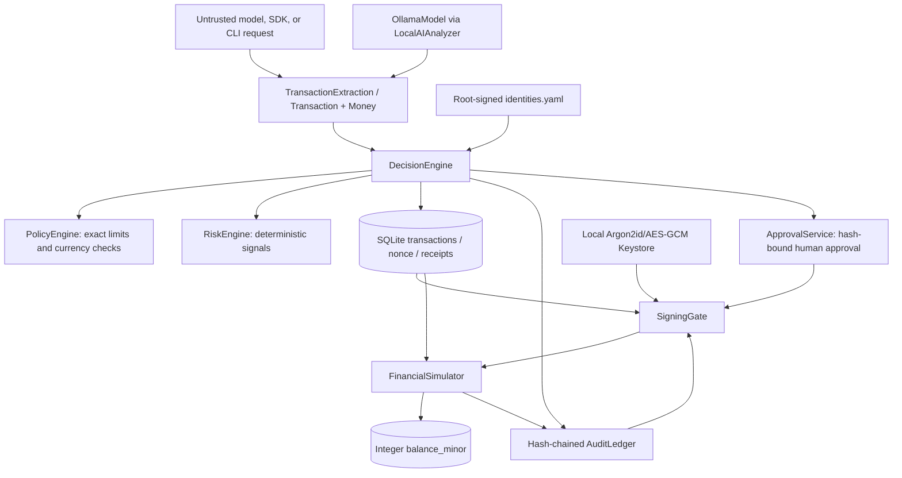
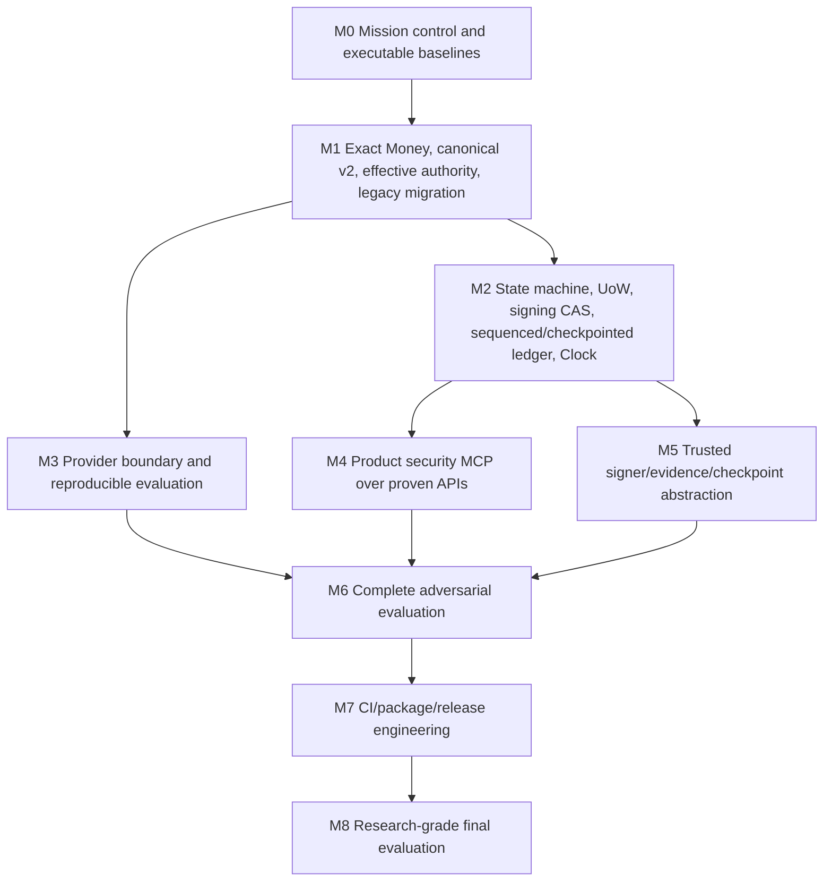

# FIN//GUARD Master Architecture and Roadmap

**State snapshot:** 2026-10-02, branch `m1-money`, source tree in the current
worktree. This describes observed code and tests, not historical reports or
intended architecture. The worktree is uncommitted; no release approval is
implied.

## Repository Baseline

- Package: `finguard`, Python >=3.12; current configured interpreter Python
  3.13.7. Runtime stack: Typer/Rich, Pydantic 2, SQLAlchemy 2/SQLite,
  cryptography/PyNaCl, argon2-cffi, networkx, PyYAML. Test tooling: pytest,
  pytest-cov/Hypothesis in dev extras, Ruff in dev extras.
- Git checkpoint: `m1-money` at `9bde6ca`, same as `origin/m1-money`; M2.1
  authority-chain changes are uncommitted. Remote is
  `https://github.com/hickytani/finCLI.git`.
- Pre-M2.1 baseline with preserved idempotency changes: **196 passed, 0 failed**.
  Current full-suite run after M2.1 changes: **207 passed, 0 failed** in 41.61s.
  SQLAlchemy `datetime.utcnow()` deprecation warnings remain.
- Focused authority-chain, simulator, signing, approval, attack and migration
  slices passed. Threaded signing and execution races each prove one winner.
- Final isolated benchmark: decision N=1000 p50 7.117 ms, p95 9.711 ms,
  p99 12.857 ms, 133.57 ops/s; Money parse/format p95 0.0021 ms; canonical hash
  p95 0.0165 ms; Ed25519 sign p95 0.0377 ms; ledger 200-entry verify 11.678 ms.
  Hardware/OS metadata was not captured, so these are diagnostic measurements,
  not a reproducible committed baseline.
- Ruff still reports repository style/import findings. The Windows shell has
  no `make`; test and attack equivalents ran directly. Migration delegates to a
  real script; docs and attack-loop Make targets remain incomplete.

## Architecture As Implemented

The flow is split across modules and multiple SQLite sessions. Signing and
execution state changes use row-level CAS; simulator balances, execution record,
and `SIGNED -> EXECUTED` CAS share one SQLite transaction. Decision, nonce,
receipt, and decision audit append do not share one atomic unit; approval/signing
audit appends also follow their database commits. There is no product
`finguard.mcp` server. `tools/devtools_mcp.py` is an engineering helper and is
not the financial-action boundary.

| Component | Current inputs/outputs and authority | State mutation / signing / execution | Evidence and gap |
| --- | --- | --- | --- |
| AI (`finguard/ai`, `agent/treasury.py`) | Local Ollama JSON is untrusted; schema yields amount/currency/destination/purpose and advisory analysis | No signing or execution capability | Local AI and AI attack tests; no provider protocol, model digest/run manifest, or CI-stable external evaluation |
| SDK / CLI | SDK and agent CLI submit to `DecisionEngine`; operator CLI exposes admin, approve and sign commands | SDK cannot sign/approve/execute; local operator CLI has privileged commands | SDK capability test and CLI help; no server-bound MCP identity |
| Money / transaction | `Money` is positive integer minor units plus INR/USD/EUR/JPY/KWD; `Transaction` defaults/fixes new transactions to canonical v2 | In-memory domain state only | Unit/property/regression tests; exact legacy database migration only partly verified |
| Identity / authority | Root-signed YAML registry with per-actor source/destination allowlists, authority limit and authority currency | Root key can mutate registry; decision path consumes actor configuration | Tests prove source lists load, empty grants deny, agent/literal wildcard denies, trusted operator wildcard use is recorded; AccountRegistry/alias resolution absent |
| Decision / policy / risk | `DecisionEngine` combines actor authority, policy, risk, nonce claim and receipt | Multiple commits/sessions create records and state | Focused decision/red-team tests; atomicity and failure recovery are not proven |
| Approval | Approval binds hash, policy request, expiry, prospective approved version, and approver key from the root-signed identity registry | Approval row/request plus APPROVED transition use one session/CAS; ledger append follows commit | Stale-version, key-substitution, forged-approved-state, duplicate-approval and integration tests; approval DB/audit are not atomic |
| Signing | Revalidates receipt, policy, authority, approval, signer identity key and authorized row version; signature remains over canonical v2 bytes | Signature/key/signed version and SIGNED transition use row-level CAS | Threaded exactly-one-signer, mutation and authority-chain tests; lifecycle version is stored/evidence-bound but not included in signature bytes |
| Simulator | Revalidates decision/audit, policy, authority, approval, signer evidence, canonical hash and Ed25519 signature | Balance debit/credit, unique execution row and EXECUTED transition CAS share one SQLite transaction | Exact approval-backed flow, tamper/substitution/replay and concurrent single-settlement tests; process/fault tests and signed checkpoints absent |
| Audit / attestation | SQLite hash chain; Ed25519 attestation checked against local configured key/live root | Appends audit; generates signed artifact | Ordinary row-tamper and attestation tests; no sequence numbers, append-only triggers, signed checkpoints, or external anchoring |
| Engineering MCP | `tools/devtools_mcp.py` tools run tests/attacks/bench and read task/invariant docs | Can launch repository commands; no transaction authority | Path jail is used for documentation reads; not a security MCP implementation |

## Trust Boundaries

- **Untrusted:** request text, model JSON, SDK/CLI values, metadata, engineering
  MCP caller parameters.
- **Controlled sources:** root-signed actor registry, policy configuration,
  approval identities, trusted local signing/attestor public keys.
- **Sensitive authority:** root key, signing keys, approval authority, policy
  and identity mutation, transaction-signing gate, simulator execution.
- **Database boundary:** row edits to transaction/receipt are detected against
  an untouched decision audit entry. The audit chain is unsigned and stored in
  the same database; a privileged writer able to rewrite the entire SQLite
  file can recompute the unkeyed chain. Do not claim resistance to that attack
  until signed checkpoints/external anchoring exist.
- **MCP boundary:** product MCP does not exist; security properties for it are
  unproven. Devtools MCP is not evidence for transaction MCP isolation.

## Dependency Graph

M3 provider work may begin after the Money wire contract is frozen, but its
measurements require stable decision outcomes. M4 must wait until M2 establishes
atomic state semantics; otherwise it creates a second interface over unsafe
write paths. M5 checkpoint work owns signing/ledger code and must be serialized
with M2. M6 consumes the stable M3/M4/M5 interfaces; M7 follows reproducible
results, not before.

## Requirement Traceability

| Requirement | Implementation | Test/attack proof | Status |
| --- | --- | --- | --- |
| Mission control | AGENTS, tasks, Makefile, devtools MCP | Tier scripts exist; some targets are placeholders | PARTIAL |
| Exact Money | `finguard/money.py`, `Currency` exponents | Unit, Hypothesis, hostile parser, AST guard | PASS in local focused tests |
| Canonical v2 and v1 compatibility | Domain prefix, integer amount, metadata digest, separate v1 encoder/vector | Canonical, metadata, offset timestamp tests | PARTIAL: G6 human/verifier approval pending; real v1 DB artifact untested |
| Effective allowlist authority | Signed source/destination actor lists, explicit actor authority currency, empty-list deny, agent wildcard deny | Registry, helper, decision, cross-currency and wildcard tests | PARTIAL: account aliases/registry and legacy actor review migration absent |
| Legacy data conversion | Dry-run/apply exactness migration, quarantine table, backup required, unsigned request fail-closed | Populated SQLite exact/inexact/non-finite fixture, dry-run immutability, idempotence | PARTIAL: not applied to user DB; restore drill and real pre-v2 artifact verification pending |
| Simulator integer money | `balance_minor` and conditional arithmetic | Representative conservation, rejected no-mutation, replay/signature tests | PARTIAL: generated multi-transfer property/stateful suite absent |
| M2.1 authority chain | Decision receipt/hash/version, registry-bound approver/signer keys, approval version, signing CAS, execution verification/CAS | Authority-chain integration and attacker regressions; 207-test full suite | PARTIAL: lifecycle version is not signed as bytes; database/audit not fully atomic |
| State and atomicity | Decision, nonce, receipt, and audit span multiple commits; no shared decision UoW | No crash injection or process-level contention proof | OPEN (M2.2) |
| CAS signing/execution | Existing row-level CAS for signing and execution; execution effects share DB transaction | Two-thread exactly-one-winner tests | PARTIAL: process-level races and fault recovery pending |
| Ledger integrity | Unsequenced hash chain and local attestation | Ordinary tamper detection only | PARTIAL; no signed checkpoint or full-chain rewrite protection |
| AI provider/evaluation | Ollama client, extraction schema, fixed 10-case AI corpus | Local AI tests and red-team tests | PARTIAL; no provider protocol/CIs/reproducible multi-model harness |
| Product MCP | No package or tool surface | No MCP-specific security tests | NOT STARTED |
| Release/CI | Packaging and documentation exist | Ruff non-green; 3 known full-suite failures; CI not run | NOT STARTED |

## Highest-Priority Work

1. Independent verifier sign-off and human approval for authenticated canonical
   byte changes; keep branch unpublished until G6 approval is recorded.
2. Run migration only against a disposable copy of a complete pre-v2 database;
   verify the generated backup restore, quarantine report, exact rows, and
   historical v1 signature verification. Do not apply to the operator database
   before explicit authorization.
3. Add AccountRegistry and alias/currency model, migrate legacy actor allowlists
   to explicit reviewed grants, and remove remaining hardcoded account literals.
4. M2.2: atomic decision UoW, process-level contention tests, crash injection,
   monotonic ledger sequence, signed checkpoints, and external anchoring. Review
   whether the canonical-signature envelope should bind lifecycle version before
   changing signature bytes.
5. Run T1/T2 and CI on Python 3.12/3.13, then repeat benchmarks with OS/hardware
  metadata; only the focused Ruff check was run for M2.1.
6. Only after M2, build product MCP, provider/evaluation integration, and release
   packaging in dependency order.

## Publication Status

The M2.1 work started from `m1-money` at `9bde6ca`. No canonical transaction
bytes, vectors, or signed transaction field set changed. The local full suite
passes 207 tests; the focused Ruff check passes on the core authority-chain
modules, while full Ruff/CI were not run. The unsigned same-database audit
limitation and M2.2 atomicity gaps remain.
