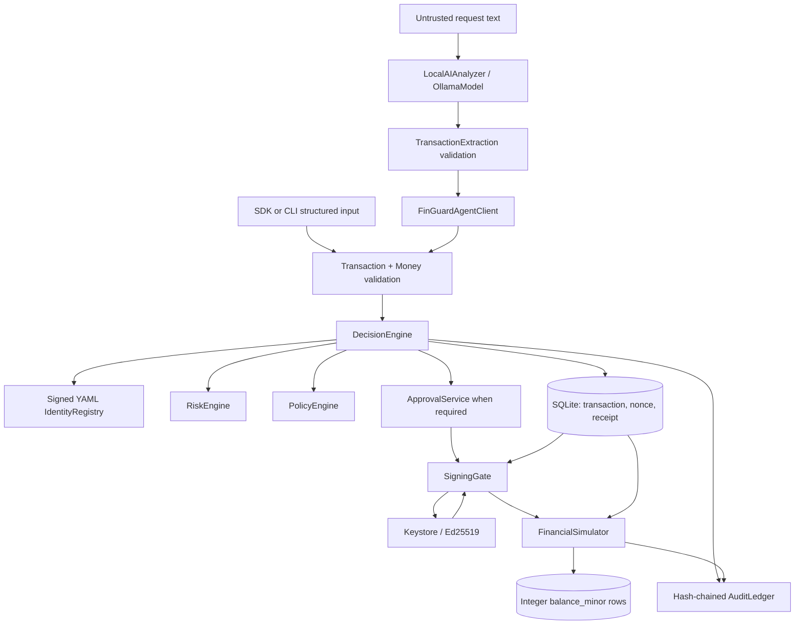
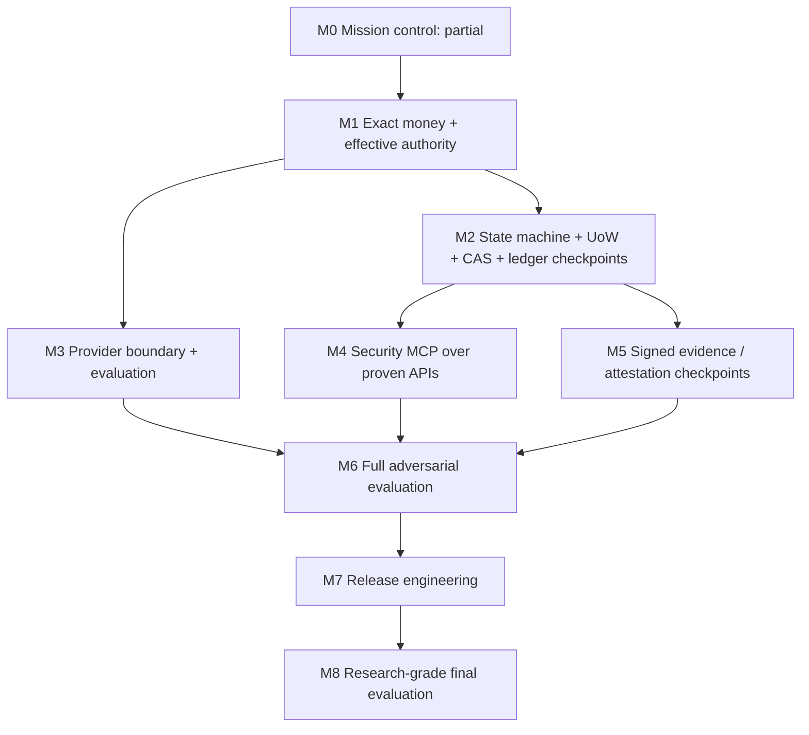

| Identity / authority | Root-signed `identities.yaml`; `_populate_actors` loads source/destination grants and `authority_currency`; decision/helper paths fail closed on empty grants, currency mismatch and agent wildcards | Signed registry config is authority source; registration requires root private key | Registry, effective decision, empty/wildcard and cross-currency tests; no AccountRegistry/alias model |
| Policy / risk | Policy schemas accept exact amount text/integer; policy/actor limit currencies are checked before minor-unit comparison; risk flags authority-currency mismatch | Deterministic allow/block/approval recommendation | Unit tests cover cross-currency authority/policy rejection; velocity aggregation still needs explicit currency scoping |
# FIN//GUARD: Architecture As Implemented

This document distinguishes code that exists from the target architecture. It
was checked against the current source tree on 2026-10-02; passing tests are
listed separately in `docs/INVARIANTS.md` and do not prove untested properties.

## Runtime FlowInvalidTransitionError, 

There is no security MCP package in the current source tree. `tools/devtools_mcp.py`
is an engineering helper and is not part of the financial transaction API.

## Component Authority

| Component | Inputs / outputs | State mutation | Can sign or execute? | Agent invocation | Invariants / evidence |
| --- | --- | --- | --- | --- | --- |
| `ai/` Ollama adapter and extraction schema | Text to structured amount/destination/purpose and advisory analysis | No transaction DB write itself | No | Reached by `TreasuryAgent`; output remains untrusted | Local AI and AI-red-team tests; no provider protocol or comparative harness |
| `agent_sdk/` | Structured request to `DecisionResult` | Via `DecisionEngine` | No | Yes, intended agent surface | `test_sdk_has_no_sign_or_self_approve` |
| CLI `tx create`, `agent-request` | Text/flags to `Transaction` | Via `DecisionEngine` | Other CLI commands separately expose approval/signing to operators | Yes, by local user, not isolated MCP identity | CLI tests are limited; amount flag now text |
| `Money` and `Transaction` | External decimal + currency to immutable minor units and transaction object | In-memory mutation guarded by Pydantic assignment validation | No | Indirectly | Money properties, canonical regressions; v2 default and exact amount binding |
| `IdentityRegistry` | Root-signed YAML to actor configuration | Registry writes require root key | No | Queried by decision path | Signature verification and registry tests; local identity/root files remain trust roots |
| `DecisionEngine` | Validated transaction, registry, policy/risk results to receipt/decision | Yes: transaction, nonce, receipt; multiple sessions/commits | No | SDK/agent enters here | Fail-closed and decision tests; not atomic as one unit of work |
| `RiskEngine` / `PolicyEngine` | Transaction and actor to deterministic results | Risk may query DB | No | Only through decision or CLI | Unit tests; default policy and actor limits still require currency consistency review |
| `ApprovalService` | Pending tx and supplied approver config/key id | Yes: requests, approvals, tx state | Signs approval payload | Not exposed by SDK; operator CLI can invoke | Hash/expiry/self-approval tests; service does not fully bind supplied approver config to registered key identity |
| `SigningGate` | Stored transaction/receipt, policy, actor, optional approval, key | Writes signature/state and audit | Yes, sole intended transaction signer | Not exposed by SDK; operator CLI invokes | Receipt hash is checked against decision audit chain; chain is unsigned and in same DB; signing is not CAS |
| `AuditLedger` | Audit event to hash-chained row; verification/attestation | Yes, append rows and attestation files | Signs attestation, not transaction | No agent SDK method | Hash-chain tests; no sequence/checkpoint or append-only DB triggers |
| `FinancialSimulator` | Stored signed transaction ID to settlement evidence | Yes, integer balances, execution record, tx state, then audit append | Executes synthetic transfer after signature verification | No agent SDK method | Signature/replay/conservation example tests; decision/settlement and audit append are not one atomic UoW |
| `devtools_mcp.py` | Fixed engineering test/attack/bench/report tools | Runs local processes; reads repo files | No transaction signing/settlement role | Engineering clients only | Path check for two file reads; no security MCP import isolation applies because financial MCP is absent |

## Trust Boundaries

- **B1 Caller/model to validation:** model text, SDK/CLI arguments and metadata
       are untrusted. `Money` and Pydantic transaction validation enforce amount and
       identifier rules, but destination aliases are not resolved by an AccountRegistry.
- **B2 Decision to signing:** the gate reconstructs the transaction and binds
       the stored receipt digest to a `DECISION` audit event, then verifies the
       ledger chain. This detects ordinary coordinated transaction/receipt edits
       when audit rows remain untouched. The entire unsigned DB ledger can still be
       rewritten by a database-file attacker.
- **B3 Process to key store:** Argon2id/AES-GCM protect local private-key files;
       host compromise and local root/attestor key compromise remain out of scope.
- **B4 Application to SQLite:** local database writes are trusted by process
       code; no signed ledger checkpoint currently makes the database an external
       trust boundary. Multi-session decision writes are not atomic.
- **B5 MCP:** only engineering devtools MCP exists; there is no product MCP
       boundary to review or claim secure.
- **B6 Signer to simulator:** simulator reloads v2 facts and verifies the
       signature before integer conditional balance updates. No distributed executor
       exists; this is synthetic local settlement only.

## State As Implemented

`TransactionState` includes CREATED, PENDING_APPROVAL, APPROVED, SIGNED,
EXECUTED, BLOCKED and FAILED. The decision engine persists CREATED first, then
separately changes it to BLOCKED, PENDING_APPROVAL, or leaves it CREATED for an
ALLOW outcome. Approval can move pending to approved; the signing gate moves to
signed; simulator moves to executed. These transitions are spread across
services, not enforced by a single state-machine module. Signing checks state
then writes later; it is not a compare-and-swap operation.

### M2 explicit control-plane contract

The repository now enforces a single lifecycle boundary in `finguard/core/state_machine.py`.
The authoritative graph is:

- `CREATED -> {PENDING_APPROVAL, SIGNED, BLOCKED, FAILED}`
- `PENDING_APPROVAL -> {APPROVED, SIGNED, BLOCKED, FAILED}`
- `APPROVED -> {SIGNED, BLOCKED, FAILED}`
- `SIGNED -> {EXECUTED, BLOCKED, FAILED}`
- `EXECUTED`, `BLOCKED`, `FAILED` are terminal states

The signing path is intentionally allowed from both the direct allow-path (`CREATED`) and the approval-backed path (`APPROVED` or a revalidated `PENDING_APPROVAL`) because the signing gate rechecks the stored decision receipt, policy, authority, nonce, and approval evidence before emitting the signature.

The `Transaction.transition_to()` method validates the requested transition and rejects stale work by comparing the expected version before the state change is committed. This does not yet implement a full distributed ledger checkpoint or a database-triggered append-only ledger, but it closes the most dangerous control-plane gap: silent, direct state mutation without an audited transition boundary.

## Dependency Graph

M3 may develop its provider abstraction after Money's public contract is frozen,
but its measurements depend on a stable deterministic decision/signing path.
M4 depends on M2 and the M1 authority behavior; exposing current non-atomic
decision endpoints prematurely would make a second entry path into unresolved
state bugs. M5 checkpoint work is needed before claims against complete local DB
rewrite. The current project has substantial M0 artifacts but no effective
typed Make gate execution, full migration runner, or reproducible results gate.
